# DD HR Diagram Pack

Each section below is a standalone Mermaid block that you can paste directly into Mermaid Live Editor or similar online viewers.

## System Architecture

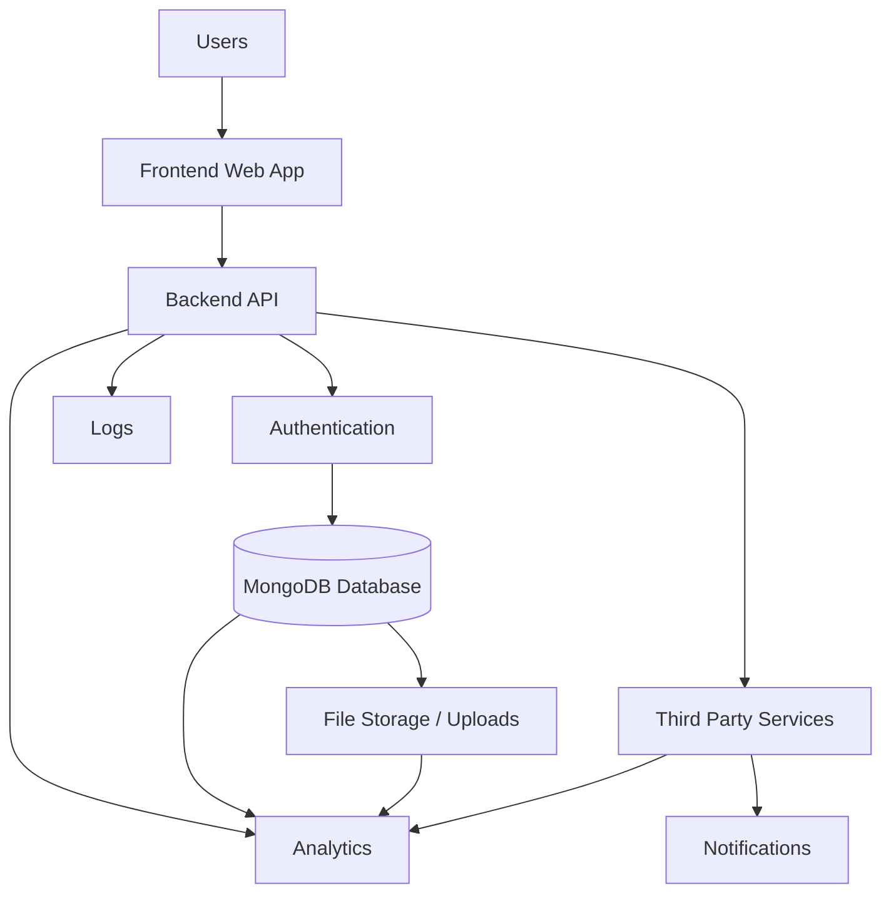

## ER Diagram

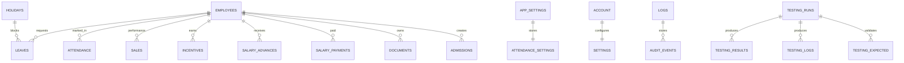

## Class Diagram

```mermaid
classDiagram
    class AuthService {
        +loginAdmin(password)
        +loginEmployee(email, password)
        +verifyToken(token)
        +changePassword()
        +resetEmployeePassword()
    }

    class EmployeeService {
        +listEmployees()
        +getEmployee(id)
        +createEmployee(data)
        +updateEmployee(id, data)
        +deleteEmployee(id)
        +uploadDocument(id, file)
    }

    class AttendanceService {
        +getSettings()
        +saveSettings()
        +getDay(date)
        +saveDay(date, records)
        +getMonth(month)
    }

    class LeaveService {
        +listLeaves()
        +listEmployeeLeaves(id)
        +createLeave(data)
        +updateLeave(id, data)
        +deleteLeave(id)
        +validateLeaveRules()
    }

    class PayrollService {
        +previewSalary(employeeId, month, year)
        +markSalaryPaid(employeeId, month, year)
        +undoSalaryPaid(key)
        +calculateDeductions()
    }

    class SalesService {
        +listSales()
        +listMonthlySales(month)
        +saveSales(data)
        +notifyTargetChange()
    }

    class IncentiveService {
        +getConfig()
        +saveConfig()
        +saveMonthlyIncentive()
        +addDailyBonus()
        +addAdvance()
        +updateAdvance()
    }

    class NotificationService {
        +sendLeaveApproved()
        +sendLeaveRejected()
        +sendTargetAssigned()
        +sendSalaryCredited()
    }

    class FileStorage {
        +saveEmployeeDocument()
        +deleteEmployeeDocument()
        +resolveUploadPath()
    }

    class BaseRepository {
        <<interface>>
        +find()
        +findOne()
        +insertOne()
        +updateOne()
        +deleteOne()
    }

    class EmployeeRepository
    class LeaveRepository
    class AttendanceRepository
    class SalesRepository
    class IncentiveRepository
    class PayrollRepository
    class LogRepository

    BaseRepository <|.. EmployeeRepository
    BaseRepository <|.. LeaveRepository
    BaseRepository <|.. AttendanceRepository
    BaseRepository <|.. SalesRepository
    BaseRepository <|.. IncentiveRepository
    BaseRepository <|.. PayrollRepository
    BaseRepository <|.. LogRepository

    AuthService --> EmployeeService
    AuthService --> LogService
    EmployeeService --> FileStorage
    EmployeeService --> LogService
    LeaveService --> NotificationService
    LeaveService --> LogService
    PayrollService --> AttendanceService
    PayrollService --> LeaveService
    PayrollService --> IncentiveService
    PayrollService --> NotificationService
    SalesService --> NotificationService
    SalesService --> LogService
    IncentiveService --> NotificationService
```

## User Login Sequence

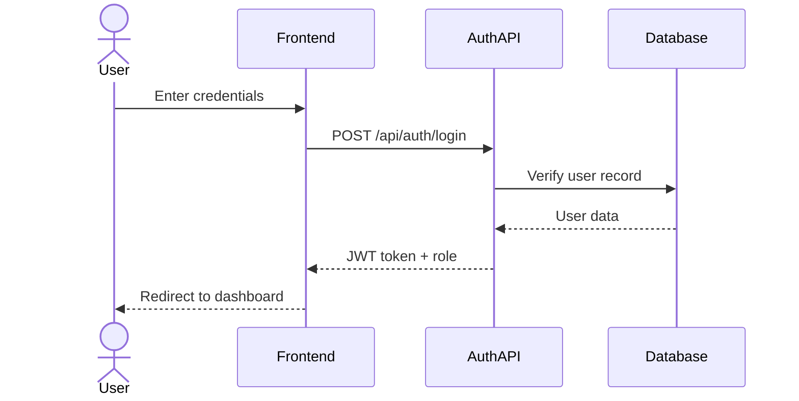

## Registration Sequence

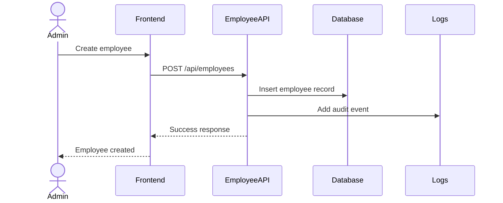

## Dashboard Load Sequence

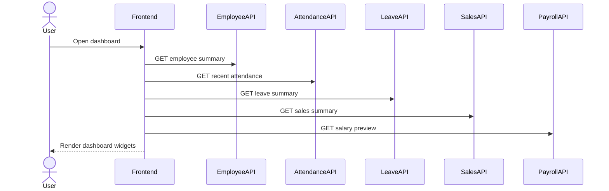

## Create Record Sequence

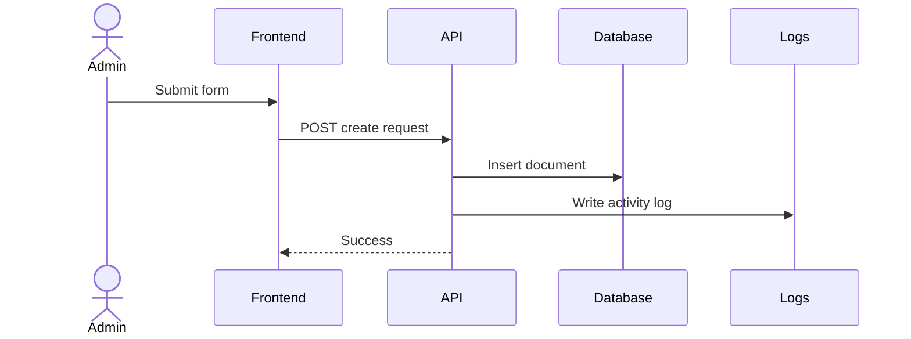

## Update Record Sequence

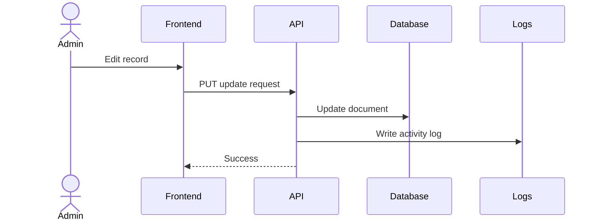

## Delete Record Sequence

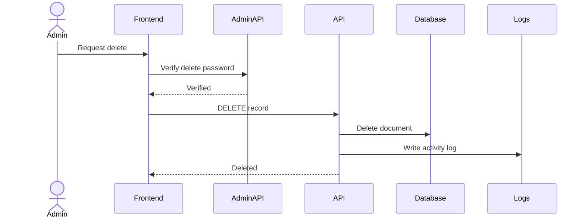

## Notifications Sequence

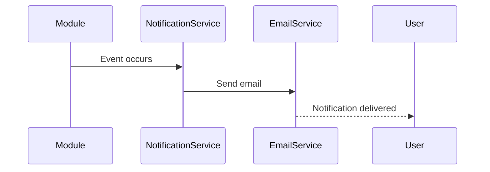

## Leave Approval Sequence

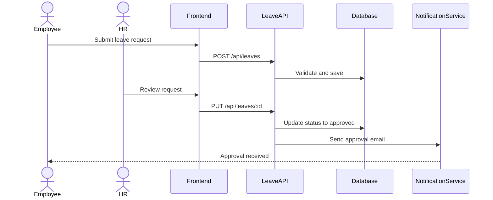

## Attendance Sequence

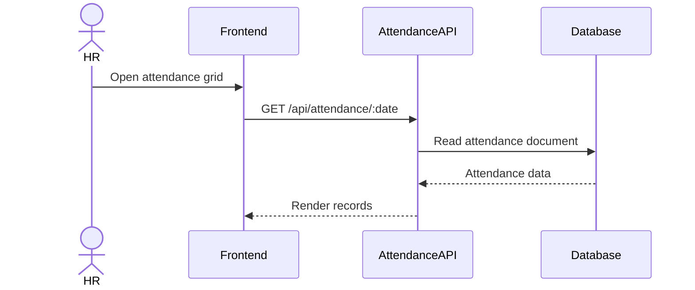

## Reports Sequence

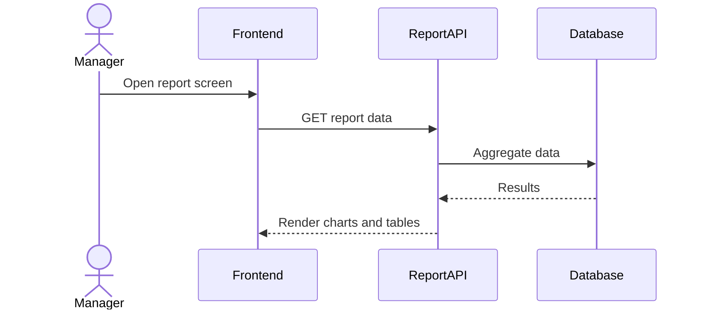

## Authentication Flowchart

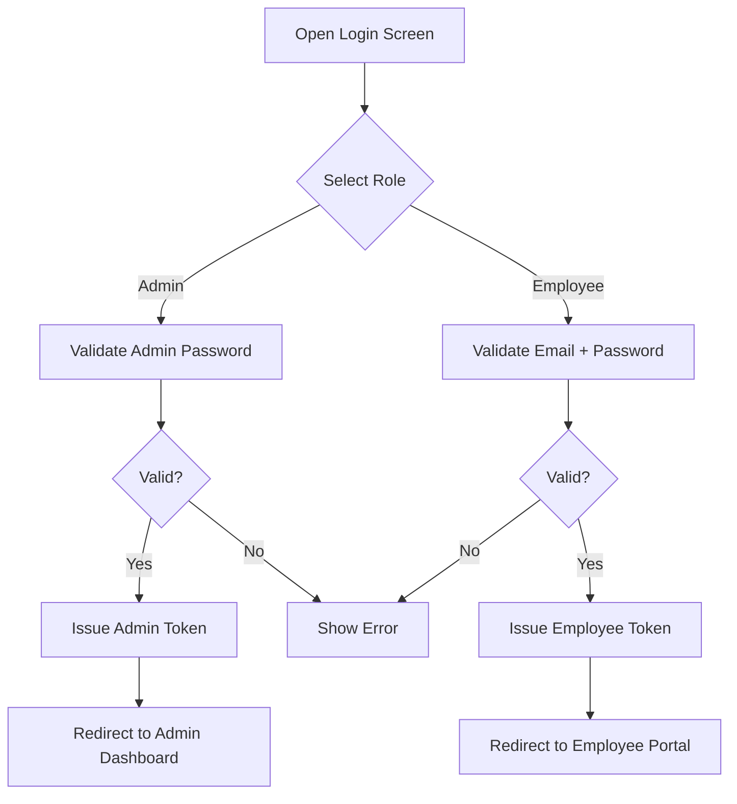

## Attendance Flowchart

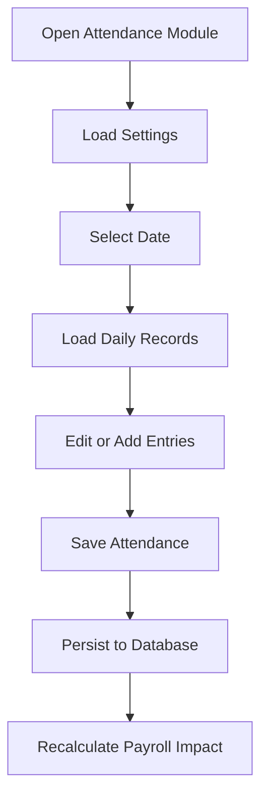

## Leave Workflow Flowchart

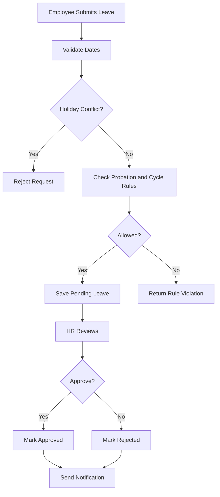

## Sales Workflow Flowchart

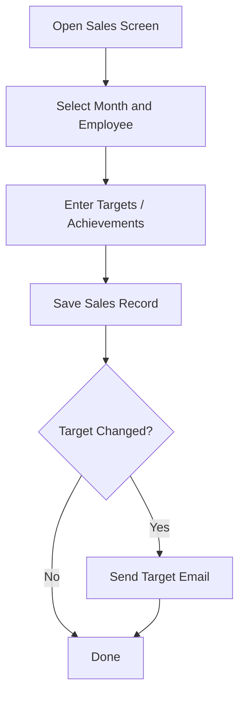

## Approval Process Flowchart

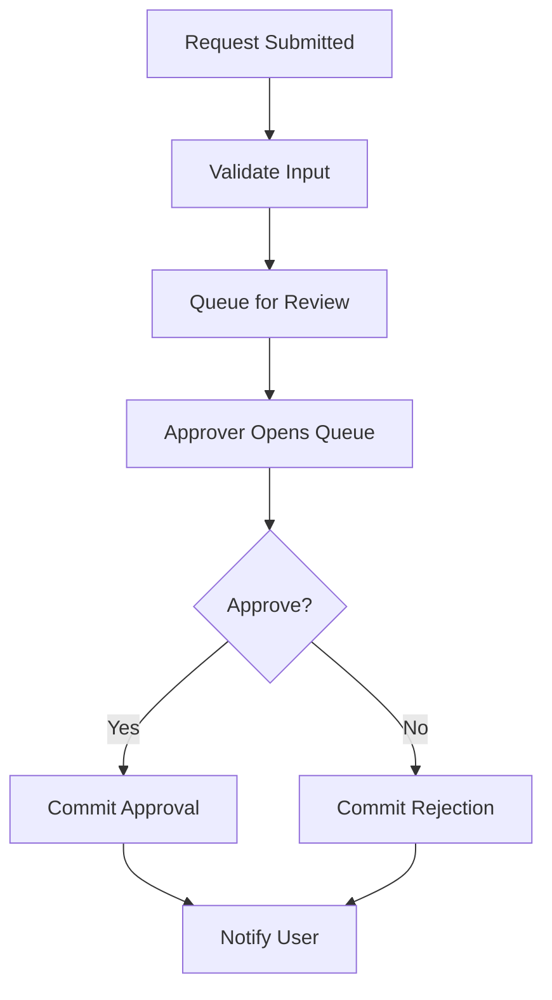

## Payment Process Flowchart

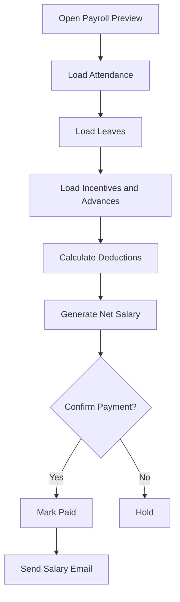

## User Registration Flowchart

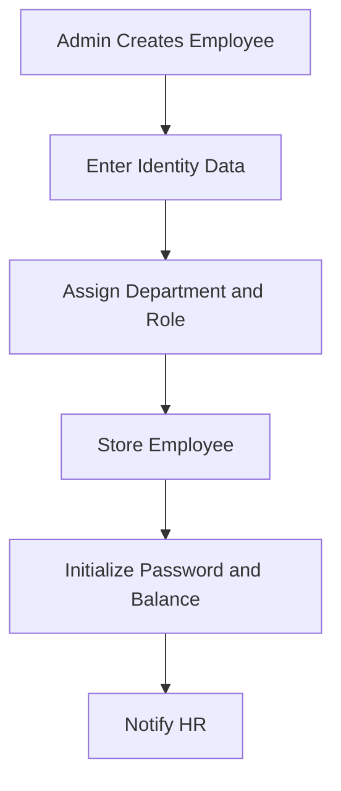

## Forgot Password Flowchart

```mermaid
flowchart TD
    A[User Requests Reset] --> B{Employee or Admin?}
    B -->|Employee| C[Verify Token or Admin Reset]
    B -->|Admin| D[Verify Current Password]
    C --> E[Set New Password]
    D --> E
    E --> F[Store New Salted Hash]
    F --> G[Confirm Reset]
```

## API Request Flowchart

```mermaid
flowchart TD
    A[Frontend Request] --> B[Attach Auth Token]
    B --> C[Backend Route Handler]
    C --> D{Validate Input}
    D -->|Fail| E[Return 4xx]
    D -->|Pass| F[Read or Update Database]
    F --> G[Write Logs]
    G --> H[Send Notifications if Needed]
    H --> I[Return Response]
```

## DFD Level 0

```mermaid
flowchart LR
    U1[Admin]
    U2[Employee]
    P0((DD HR System))
    D1[(MongoDB)]
    D2[(File Storage)]
    E1[[Email Service]]

    U1 --> P0
    U2 --> P0
    P0 --> D1
    P0 --> D2
    P0 --> E1
    D1 --> P0
    D2 --> P0
    E1 --> U1
    E1 --> U2
```

## DFD Level 1

```mermaid
flowchart TB
    A[Authentication Process]
    B[Employee Management]
    C[Attendance Process]
    D[Leave Process]
    E[Payroll Process]
    F[Sales and Incentives]
    G[Logs and Reports]

    DB[(MongoDB)]
    FS[(File Storage)]
    EM[[Email Service]]

    A --> DB
    B --> DB
    B --> FS
    C --> DB
    D --> DB
    D --> EM
    E --> DB
    E --> EM
    F --> DB
    F --> EM
    G --> DB
```

## DFD Level 2

```mermaid
flowchart TB
    A1[Login Validation]
    A2[Token Issuance]
    B1[Employee CRUD]
    B2[Document Upload]
    C1[Daily Attendance Save]
    C2[Monthly Attendance View]
    D1[Leave Validation]
    D2[Leave Approval]
    E1[Salary Preview]
    E2[Salary Mark Paid]
    F1[Sales Target Entry]
    F2[Incentive Calculation]
    G1[Activity Log Write]
    G2[Testing Report Read]

    DB[(MongoDB)]
    FS[(File Storage)]
    EM[[Email Service]]

    A1 --> DB
    A2 --> DB
    B1 --> DB
    B2 --> FS
    C1 --> DB
    C2 --> DB
    D1 --> DB
    D2 --> EM
    E1 --> DB
    E2 --> EM
    F1 --> DB
    F2 --> EM
    G1 --> DB
    G2 --> DB
```

## Use Case Diagram

```mermaid
flowchart LR
    Admin((Admin))
    HR((HR))
    Employee((Employee))
    Manager((Manager))
    SuperAdmin((Super Admin))
    External((External APIs))

    UC1[Login]
    UC2[Manage Employees]
    UC3[Track Attendance]
    UC4[Apply Leave]
    UC5[Approve Leave]
    UC6[Manage Holidays]
    UC7[Manage Sales]
    UC8[Configure Incentives]
    UC9[Run Payroll]
    UC10[View Reports]
    UC11[Manage Logs]
    UC12[Send Email]
    UC13[Store Files]

    Admin --> UC1
    Admin --> UC2
    Admin --> UC3
    Admin --> UC5
    Admin --> UC6
    Admin --> UC7
    Admin --> UC8
    Admin --> UC9
    Admin --> UC10
    Admin --> UC11

    HR --> UC2
    HR --> UC3
    HR --> UC4
    HR --> UC5
    HR --> UC6
    HR --> UC8
    HR --> UC9
    HR --> UC10

    Employee --> UC1
    Employee --> UC4
    Employee --> UC10

    Manager --> UC3
    Manager --> UC5
    Manager --> UC7
    Manager --> UC10

    SuperAdmin --> UC11
    SuperAdmin --> UC9
    SuperAdmin --> UC2

    External --> UC12
    External --> UC13
```

## Component Diagram

```mermaid
flowchart TB
    subgraph Frontend
        F1[Login UI]
        F2[Dashboard]
        F3[Employees UI]
        F4[Attendance UI]
        F5[Leaves UI]
        F6[Payroll UI]
        F7[Reports UI]
    end

    subgraph Backend
        B1[Auth Service]
        B2[Employee Service]
        B3[Attendance Service]
        B4[Leave Service]
        B5[Sales Service]
        B6[Incentive Service]
        B7[Logs Service]
        B8[Testing Service]
    end

    DB[(MongoDB)]
    FS[(File Storage)]
    NS[[Notification Service]]
    EXT[[External APIs]]

    F1 --> B1
    F2 --> B2
    F2 --> B3
    F2 --> B4
    F2 --> B5
    F2 --> B6
    F3 --> B2
    F4 --> B3
    F5 --> B4
    F6 --> B6
    F6 --> B5
    F7 --> B8

    B1 --> DB
    B2 --> DB
    B2 --> FS
    B3 --> DB
    B4 --> DB
    B4 --> NS
    B5 --> DB
    B5 --> NS
    B6 --> DB
    B6 --> NS
    B7 --> DB
    B8 --> DB
    NS --> EXT
```

## Deployment Diagram

```mermaid
flowchart TB
    Browser[Browser]
    Mobile[Mobile App]
    CDN[CDN]
    LB[Load Balancer]
    BE[Backend Server]
    DB[(Database Server)]
    FS[(File Storage)]
    Cloud[Cloud Hosting]
    SSL[SSL/TLS]
    Domain[Custom Domain]

    Browser --> Domain
    Mobile --> Domain
    Domain --> SSL
    SSL --> CDN
    CDN --> LB
    LB --> BE
    BE --> DB
    BE --> FS
    BE --> Cloud
```

## Leave State

```mermaid
stateDiagram-v2
    [*] --> Draft
    Draft --> Pending
    Pending --> Approved
    Pending --> Rejected
    Approved --> [*]
    Rejected --> [*]
```

## Attendance State

```mermaid
stateDiagram-v2
    [*] --> Unmarked
    Unmarked --> Present
    Unmarked --> Late
    Unmarked --> Absent
    Late --> HalfDay
    Present --> Finalized
    Late --> Finalized
    Absent --> Finalized
```

## Employee State

```mermaid
stateDiagram-v2
    [*] --> Active
    Active --> OnProbation
    OnProbation --> Active
    Active --> Inactive
    Inactive --> Active
    Inactive --> Terminated
```

## Tasks State

```mermaid
stateDiagram-v2
    [*] --> Open
    Open --> InProgress
    InProgress --> Blocked
    Blocked --> InProgress
    InProgress --> Done
    Done --> [*]
```

## Sales State

```mermaid
stateDiagram-v2
    [*] --> NotSet
    NotSet --> TargetSet
    TargetSet --> InProgress
    InProgress --> Achieved
    InProgress --> Missed
    Achieved --> Closed
    Missed --> Closed
```

## Payments State

```mermaid
stateDiagram-v2
    [*] --> Draft
    Draft --> Previewed
    Previewed --> Paid
    Previewed --> Reversed
    Paid --> Reversed
    Reversed --> [*]
```

## Employee Login Activity

```mermaid
flowchart TD
    A[Open Login] --> B[Enter Credentials]
    B --> C[Submit]
    C --> D[Validate]
    D --> E{Success?}
    E -->|Yes| F[Create Session]
    E -->|No| G[Show Error]
```

## Attendance Activity

```mermaid
flowchart TD
    A[Open Attendance] --> B[Load Date]
    B --> C[Review Records]
    C --> D[Edit Entries]
    D --> E[Save]
    E --> F[Persist]
```

## Leave Activity

```mermaid
flowchart TD
    A[Open Leave Form] --> B[Enter Dates]
    B --> C[Run Business Rules]
    C --> D{Valid?}
    D -->|Yes| E[Submit]
    D -->|No| F[Show Error]
    E --> G[Review and Approve]
```

## Salary Calculation Activity

```mermaid
flowchart TD
    A[Open Payroll Preview] --> B[Load Employee Data]
    B --> C[Load Attendance]
    C --> D[Load Leaves]
    D --> E[Load Incentives]
    E --> F[Compute Net Salary]
    F --> G[Display Breakup]
```

## Reports Activity

```mermaid
flowchart TD
    A[Open Reports] --> B[Select Filter]
    B --> C[Query Aggregates]
    C --> D[Generate Charts]
    D --> E[Export or Share]
```

## Dashboard Activity

```mermaid
flowchart TD
    A[Login] --> B[Open Dashboard]
    B --> C[Fetch Summary Cards]
    C --> D[Fetch Recent Activity]
    D --> E[Fetch Charts]
    E --> F[Render Dashboard]
```
