# DD HR Enterprise Architecture

This document is based on the current codebase in the workspace and treats it as an enterprise HR, attendance, payroll, sales, and employee self-service platform.

Important note: the current implementation uses two enforced auth roles in code, `admin` and `employee`. For enterprise design completeness, this document also describes logical business roles such as HR Manager, Manager, and Super Admin as role layers that can be mapped onto the existing authorization model.

---

# 1. Project Understanding

## Purpose

DD HR is an internal HR operations system for managing employees, attendance, leave, holidays, sales performance, incentives, salary payments, employee documents, account/profile data, logs, admissions, and testing/reporting utilities. The application serves both administrators and employees through a browser-based frontend and a Node.js/MongoDB backend API.

The system is designed to support day-to-day HR operations, operational analytics, payroll calculations, and self-service actions such as login, leave requests, document uploads, and password changes.

## Modules

### Frontend modules
- Authentication and login
- Admin dashboard
- Employee management
- Attendance management
- Leave management
- Leave calendar
- Holidays management
- Sales tracking
- Incentives and payroll screens
- Account/profile management
- Activity logs
- Chatbot/help assistant
- Employee portal
- Testing dashboard and reports

### Backend modules
- Authentication API
- Employee API
- Attendance API
- Leave API
- Holidays API
- Sales API
- Incentives API
- Salary payments API
- Logs API
- Account API
- Admin verification API
- Admissions API
- Testing API

### Data and platform modules
- MongoDB persistence layer
- File storage for employee documents and uploads
- Email notifications
- Audit logging
- Testing and reporting collections

## User Roles

### 1. Super Admin
Enterprise-level owner of the platform. In the current code this is effectively represented by the admin token and the admin credentials store.

### 2. HR Manager
Operational administrator for employee records, attendance, leaves, holidays, account profile, logs, payroll visibility, and document management.

### 3. Manager
Department-level approver and supervisor. In a full enterprise rollout this role can approve leaves, review attendance, and monitor team performance.

### 4. Employee
Self-service user who can log in, view portal data, request leave, review attendance and salary-related information, upload documents, and change password.

### 5. External APIs / Services
Mail service, storage layer, database provider, and any future analytics or messaging platforms.

## Permissions By Role

### Super Admin
- Full access to all modules
- Manage all employee records
- Configure system policies
- Reset passwords
- View and clear logs
- Approve or override payroll and leave decisions
- Access testing/reporting tools
- Manage deletion verification and sensitive actions

### HR Manager
- Create, update, and delete employees
- Manage attendance settings and daily attendance records
- Review and approve/reject leaves
- Maintain holidays
- Manage sales targets and incentive settings
- Record salary payments and advances
- View audit logs
- Manage account/profile data
- Handle employee documents

### Manager
- View team employees and team attendance
- Review leaves for direct reports
- Track sales performance and targets for assigned department
- Monitor attendance and late trends
- View reports for their scope

### Employee
- Authenticate into the portal
- View own profile and dashboard data
- Request and track leave
- View attendance and salary-related summaries
- Upload and retrieve own documents
- Change own password
- View own sales/incentive summaries where applicable

### External APIs / Services
- Receive outbound email notifications
- Persist data in MongoDB
- Store uploaded files in the file system or object storage
- Support analytics and reporting integrations

## Complete Workflow

1. A user opens the frontend and signs in through the login screen.
2. The authentication API verifies the credentials and issues a token with role context.
3. The frontend stores the token and uses it for page gating and request headers.
4. Admin users access operational modules such as employees, attendance, leaves, holidays, sales, incentives, salary payments, account, and logs.
5. Employees access their portal for profile data, leave requests, attendance visibility, documents, and self-service password changes.
6. Attendance records are created and used later by payroll calculations.
7. Leave requests pass through business rules such as holiday blocking, probation restrictions, salary-cycle limits, and sandwich-day logic.
8. Sales and admissions data are captured and used to compute performance and incentive data.
9. Salary payments are previewed and finalized using attendance, leaves, incentives, bonuses, and advances.
10. Sensitive actions are logged and can be reviewed in the logs module.
11. Emails are sent for events such as leave approval, leave rejection, target assignment, and salary crediting.
12. Testing collections store automation and verification data for system health and reporting.

---

# 2. System Architecture Diagram

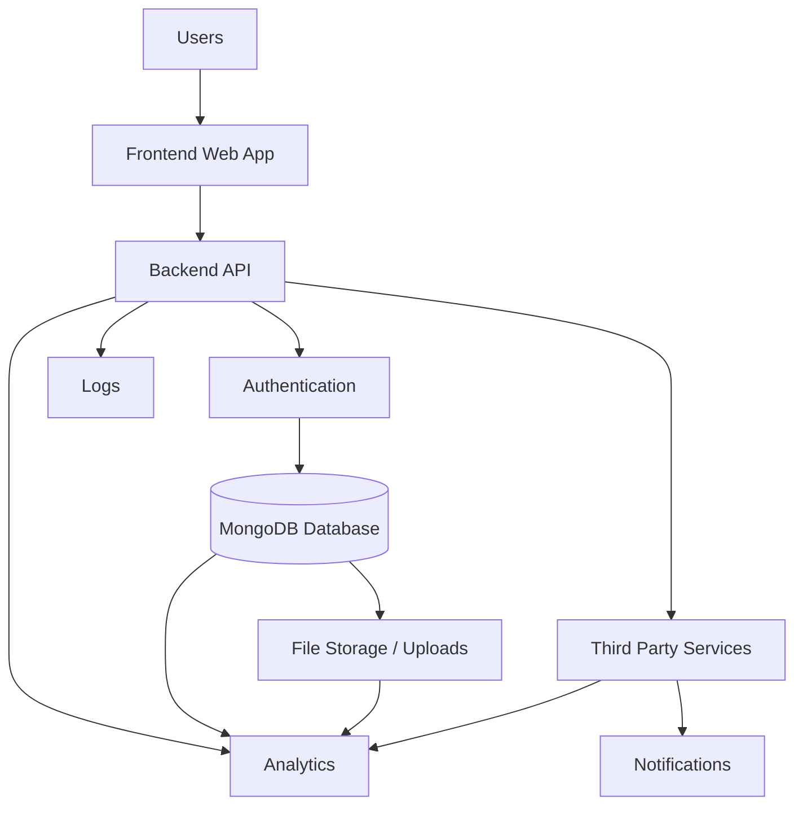

---

# 3. Entity Relationship Diagram

The current implementation is document-based in MongoDB, so the ERD below models the logical entities as enterprise collections.

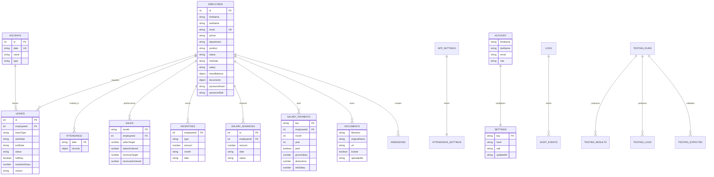

## Relationship Notes
- One employee can have many leaves, attendance records, sales records, advances, and payments.
- A holiday can block multiple leave requests.
- Documents are embedded inside the employee record, but they behave like one-to-many child entities.
- Testing collections are operational support data and are not part of the business domain ERD.
- Deletions should cascade from employee to dependent records, documents, and derived payroll data.

## Normalization Notes
- Core business entities should remain logically normalized at the collection level.
- Repeating data such as documents, leave balance history, daily bonuses, and salary advances should be isolated into dedicated collections or embedded subdocuments only when tightly coupled.
- Lookup data such as role names, leave types, holiday types, and attendance settings should be centralized.

## Cascade Delete Rules
- Deleting an employee should remove or archive associated leaves, attendance references, incentives, advances, payments, and documents.
- Deleting a holiday should not affect employee history, but should re-evaluate leave validation rules.
- Deleting a leave should restore any leave-balance impact that was previously applied.

## Index Strategy
- Employees: unique index on id and email, plus department and status indexes.
- Leaves: index on employeeId and status.
- Holidays: unique index on date.
- Sales: compound index on month and employeeId.
- Logs: index on timestamp and type.
- Attendance: index on date.
- Salary payments: compound index on employeeId, month, and year.

---

# 4. Database Design

The database is MongoDB-based, but the following design treats each collection like a logical enterprise table.

## 4.1 employees

Purpose: master employee record and the primary source of identity, profile, payroll, and document data.

Columns:
- id, int, not nullable, generated sequence, primary business key
- firstName, string, not nullable
- lastName, string, not nullable
- email, string, nullable in some legacy records, unique
- companyEmail, string, nullable, unique where used
- phone, string, nullable, indexed
- department, string, nullable, indexed
- position, string, nullable
- status, string, not nullable, default Active
- hireDate, string/date, nullable
- salary, number/string, nullable, default 0
- leaveBalance, object, nullable, default embedded balance object
- documents, object, nullable, default empty object
- passwordHash, string, nullable
- passwordSalt, string, nullable
- isOnProbation, boolean, nullable, default false

Constraints:
- Unique employee ID
- Unique email where present
- Status must be from approved values
- Salary must be non-negative

Indexes:
- id unique
- email unique
- status
- department

## 4.2 leaves

Purpose: stores leave applications, approvals, rejections, and balances.

Columns:
- id, int, primary key
- employeeId, int, foreign key to employees.id
- leaveType, string, not nullable
- startDate, string/date, not nullable
- endDate, string/date, not nullable
- status, string, not nullable, default pending
- reason, string, nullable
- halfDay, boolean, default false
- sandwichDays, number, default 0
- paidSandwichDays, number, default 0
- createdAt, date/time, default now
- updatedAt, date/time, default now

Constraints:
- End date must be greater than or equal to start date
- Leave dates cannot overlap holidays when business rule is enabled
- Salary-cycle paid-leave rule enforced by application logic

Indexes:
- employeeId
- status
- startDate

## 4.3 attendance

Purpose: daily attendance snapshot.

Columns:
- date, string, primary key, format YYYY-MM-DD
- records, object, embedded map of employee attendance entries

Constraints:
- One document per date
- Record keys should be employee IDs

Indexes:
- date

## 4.4 holidays

Purpose: organization holiday calendar.

Columns:
- id, int, primary key
- date, string, unique, format YYYY-MM-DD
- name, string, not nullable
- type, string, nullable
- notes, string, nullable

Constraints:
- Unique date

Indexes:
- date unique

## 4.5 sales

Purpose: monthly sales and revenue targets and achievements.

Columns:
- month, string, not nullable, format YYYY-MM
- employeeId, int, foreign key to employees.id
- salesTarget, number, default 0
- salesAchieved, number, default 0
- revenueTarget, number, default 0
- revenueAchieved, number, default 0
- updatedAt, date/time, default now

Constraints:
- Unique logical pair of month and employeeId
- Numeric values must be non-negative

Indexes:
- month
- employeeId
- compound month + employeeId

## 4.6 incentive_config

Purpose: central incentive rule configuration.

Columns:
- slabs, object, nullable
- courseRewards, object, nullable
- dailyTarget, object, nullable
- updatedAt, date/time, default now

Constraints:
- Stored as a single configuration document

Indexes:
- none required beyond default

## 4.7 monthly_incentives

Purpose: monthly incentive payment ledger.

Columns:
- key, string, primary key, format YYYY-MM_employeeId
- paid, boolean, default false
- paidDate, string/date, nullable
- amount, number, default 0
- updatedAt, date/time, default now

Constraints:
- Unique key

Indexes:
- key unique
- paid

## 4.8 daily_bonuses

Purpose: daily bonus entries.

Columns:
- id, object id or generated id, primary key
- employeeId, int, foreign key
- date, string, format YYYY-MM-DD
- amount, number, default 0
- note, string, nullable

Constraints:
- Employee and date combination should be unique for strict enterprise use

Indexes:
- employeeId
- date

## 4.9 salary_advances

Purpose: employee salary advance ledger.

Columns:
- id, int, primary key
- employeeId, int, foreign key
- amount, number, not nullable
- date, string/date, not nullable
- status, string, default Outstanding
- repaid, boolean, default false
- repaidDate, string/date, nullable
- adjustedInSalary, boolean, default false
- adjustedMonth, string, nullable
- updatedAt, date/time, default now

Constraints:
- Amount must be positive
- Status must be in allowed lifecycle states

Indexes:
- employeeId
- status
- date

## 4.10 salary_payments

Purpose: salary payout results and payment history.

Columns:
- key, string, primary key, format YYYY-MM_employeeId
- employeeId, int, foreign key
- month, int, not nullable
- year, int, not nullable
- paid, boolean, default false
- paidAt, date/time, nullable
- grossSalary, number, default 0
- deductions, number, default 0
- netSalary, number, default 0
- updatedAt, date/time, default now

Constraints:
- Unique period key
- Month between 1 and 12
- Year must be valid

Indexes:
- key unique
- employeeId
- month + year

## 4.11 account

Purpose: administrative profile and organization account data.

Columns:
- firstName, string
- lastName, string
- email, string
- phone, string
- role, string
- joinDate, string/date

Constraints:
- Single record design

Indexes:
- email if needed

## 4.12 settings

Purpose: password and system settings storage.

Columns:
- key, string, primary key
- hash, string
- salt, string
- updatedAt, date/time

Constraints:
- key must be unique

Indexes:
- key unique

## 4.13 appSettings

Purpose: application policy settings such as attendance configuration.

Columns:
- _id, string, primary key
- officeStartTime, string
- lateThresholdMins, number
- lateDaysHalfDay, number

Constraints:
- Single document per settings type

Indexes:
- _id unique

## 4.14 logs

Purpose: audit and activity log collection.

Columns:
- timestamp, date/time, not nullable, indexed
- type, string
- module, string
- message, string
- actor, string
- metadata, object

Constraints:
- Append-only in enterprise mode

Indexes:
- timestamp descending
- type

## 4.15 admissions

Purpose: admissions or lead-like operational records used by the sales flow.

Columns:
- id, int, primary key
- status, string
- createdAt, date/time
- updatedAt, date/time
- source, string
- employeeId, int, optional foreign key

Constraints:
- Business-state validation by route logic

Indexes:
- status
- createdAt

## 4.16 testing collections

Purpose: stores automated test metadata, results, expected output, and logs.

Collections:
- TestingRuns
- TestingResults
- TestingExpected
- TestingLogs
- TestingSummary

These are operational and should remain separated from production HR data.

---

# 5. Class Diagram

```mermaid
classDiagram
    class AuthService {
        +loginAdmin(password)
        +loginEmployee(email, password)
        +verifyToken(token)
        +changePassword()
        +resetEmployeePassword()
    }

    class EmployeeService {
        +listEmployees()
        +getEmployee(id)
        +createEmployee(data)
        +updateEmployee(id, data)
        +deleteEmployee(id)
        +uploadDocument(id, file)
    }

    class AttendanceService {
        +getSettings()
        +saveSettings()
        +getDay(date)
        +saveDay(date, records)
        +getMonth(month)
    }

    class LeaveService {
        +listLeaves()
        +listEmployeeLeaves(id)
        +createLeave(data)
        +updateLeave(id, data)
        +deleteLeave(id)
        +validateLeaveRules()
    }

    class PayrollService {
        +previewSalary(employeeId, month, year)
        +markSalaryPaid(employeeId, month, year)
        +undoSalaryPaid(key)
        +calculateDeductions()
    }

    class SalesService {
        +listSales()
        +listMonthlySales(month)
        +saveSales(data)
        +notifyTargetChange()
    }

    class IncentiveService {
        +getConfig()
        +saveConfig()
        +saveMonthlyIncentive()
        +addDailyBonus()
        +addAdvance()
        +updateAdvance()
    }

    class LogService {
        +listLogs()
        +addLog()
        +clearLogs()
    }

    class NotificationService {
        +sendLeaveApproved()
        +sendLeaveRejected()
        +sendTargetAssigned()
        +sendSalaryCredited()
    }

    class FileStorage {
        +saveEmployeeDocument()
        +deleteEmployeeDocument()
        +resolveUploadPath()
    }

    class BaseRepository {
        <<interface>>
        +find()
        +findOne()
        +insertOne()
        +updateOne()
        +deleteOne()
    }

    class EmployeeRepository
    class LeaveRepository
    class AttendanceRepository
    class SalesRepository
    class IncentiveRepository
    class PayrollRepository
    class LogRepository

    BaseRepository <|.. EmployeeRepository
    BaseRepository <|.. LeaveRepository
    BaseRepository <|.. AttendanceRepository
    BaseRepository <|.. SalesRepository
    BaseRepository <|.. IncentiveRepository
    BaseRepository <|.. PayrollRepository
    BaseRepository <|.. LogRepository

    AuthService --> EmployeeService
    AuthService --> LogService
    EmployeeService --> FileStorage
    EmployeeService --> LogService
    LeaveService --> NotificationService
    LeaveService --> LogService
    PayrollService --> AttendanceService
    PayrollService --> LeaveService
    PayrollService --> IncentiveService
    PayrollService --> NotificationService
    SalesService --> NotificationService
    SalesService --> LogService
    IncentiveService --> NotificationService
```

---

# 6. Sequence Diagrams

## User Login

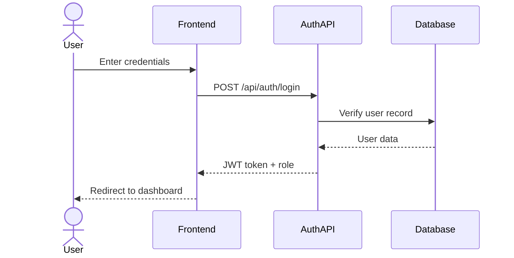

## Registration

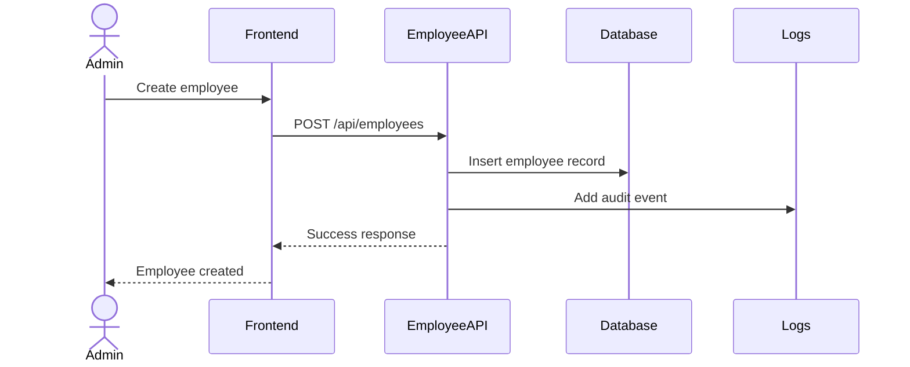

## Dashboard Load

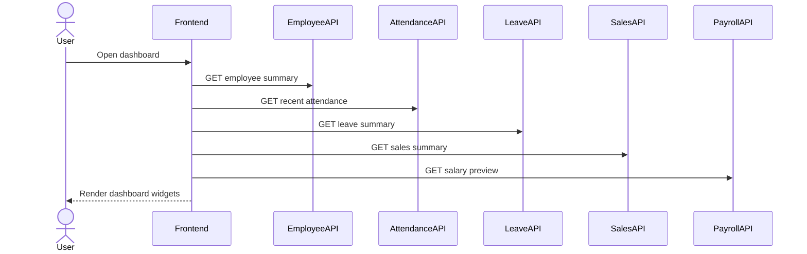

## Create Record

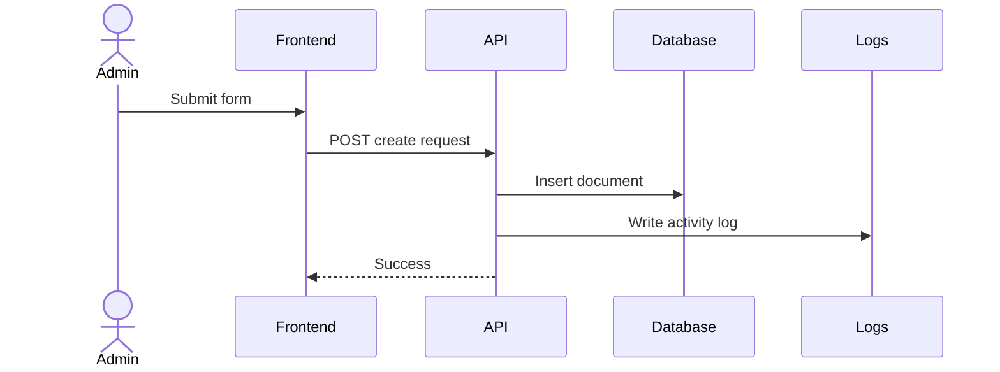

## Update Record

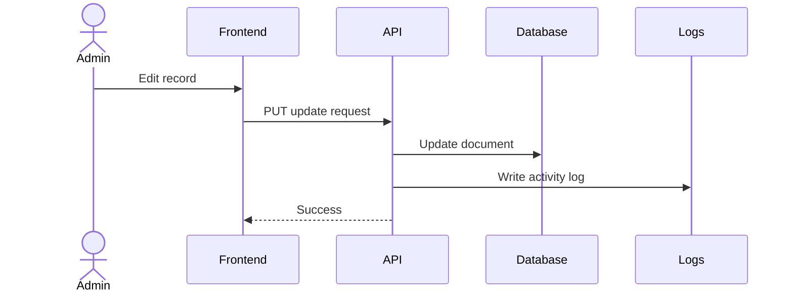

## Delete Record

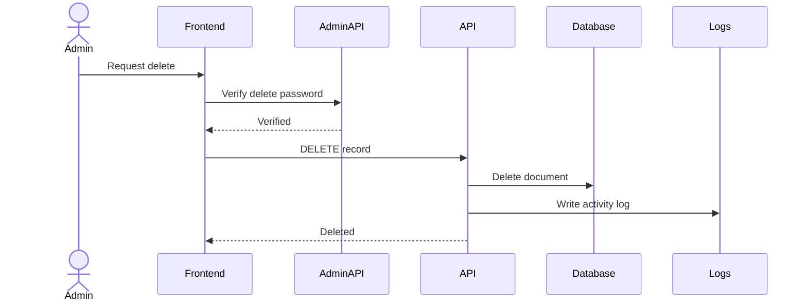

## Notifications

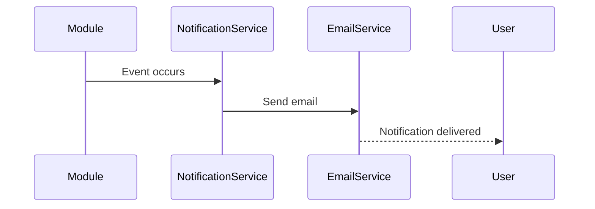

## Leave Approval

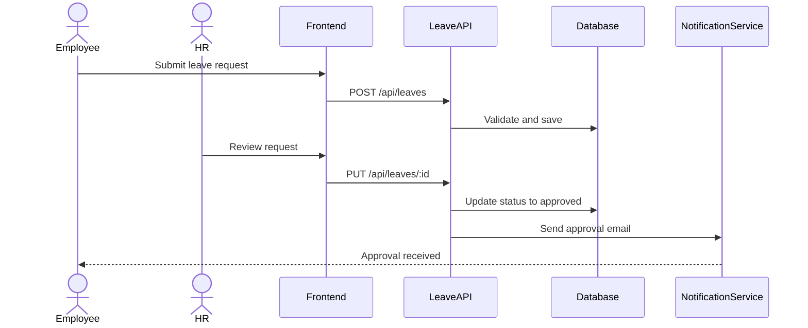

## Attendance

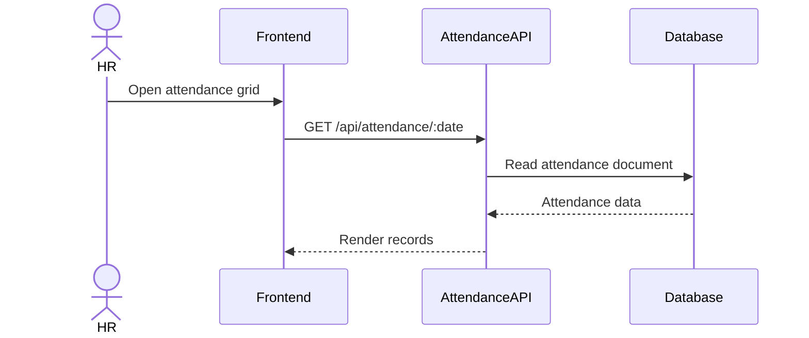

## Reports

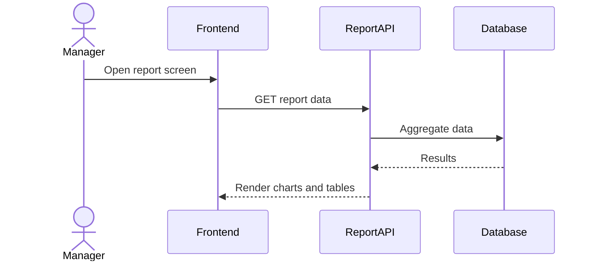

---

# 7. Flowcharts

## Authentication

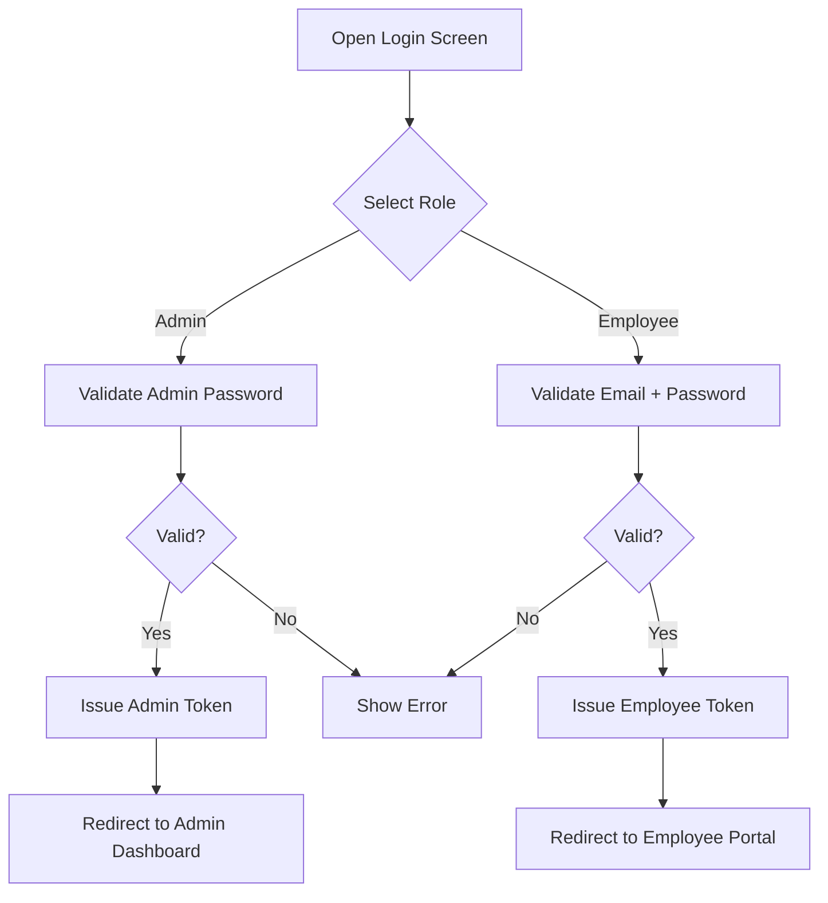

## Attendance

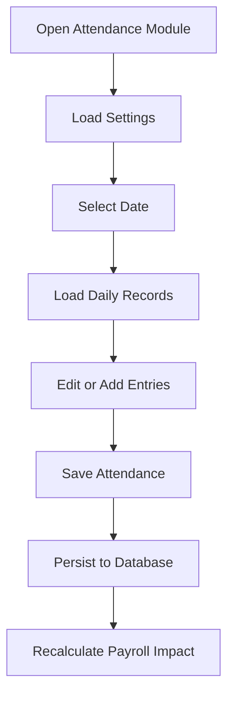

## Leave Workflow

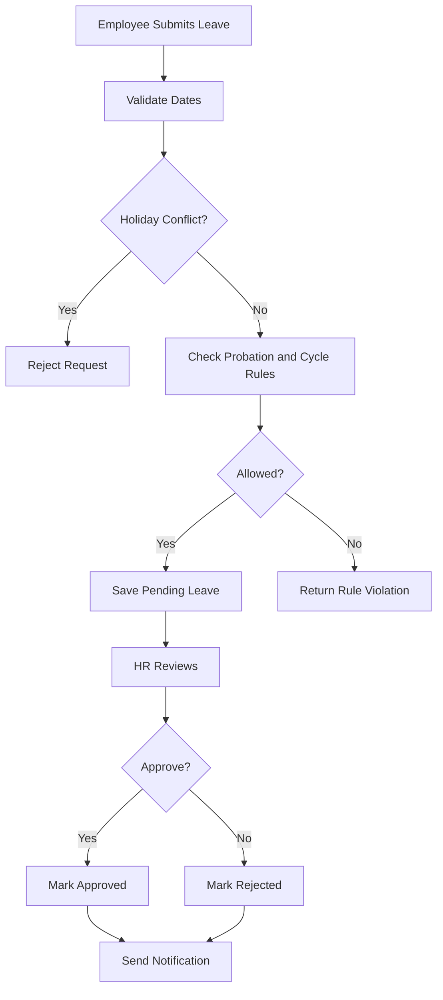

## Sales Workflow

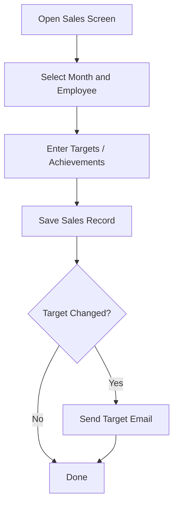

## Approval Process

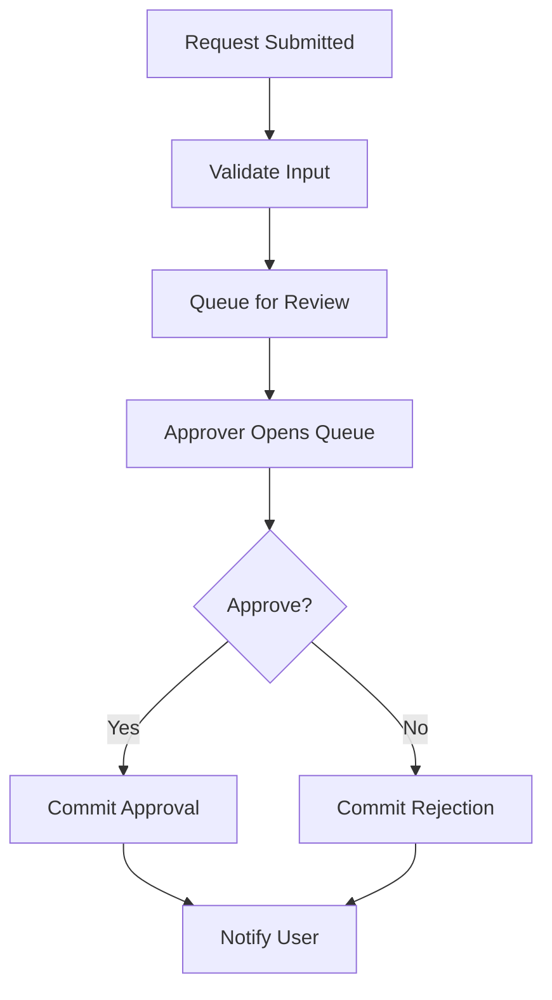

## Payment Process

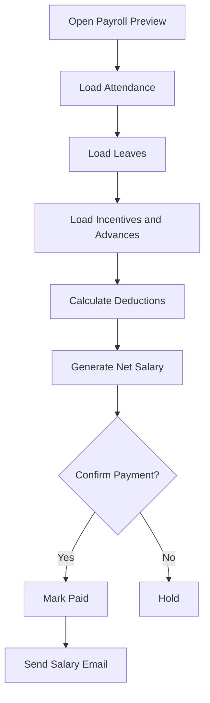

## User Registration

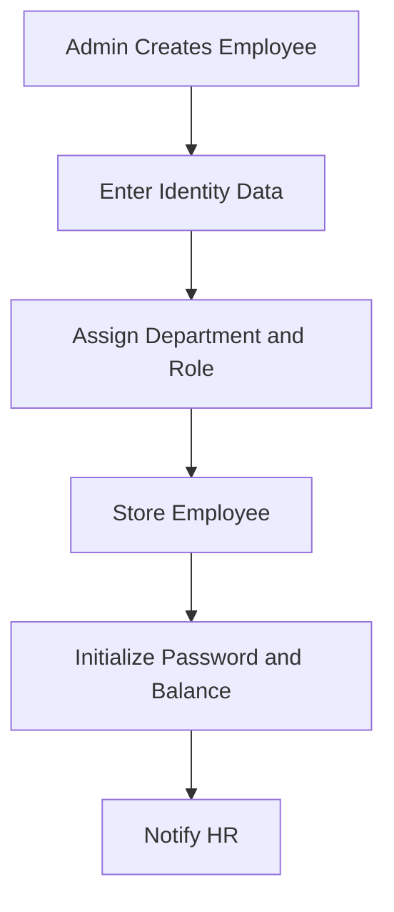

## Forgot Password

```mermaid
flowchart TD
    A[User Requests Reset] --> B{Employee or Admin?}
    B -->|Employee| C[Verify Token or Admin Reset]
    B -->|Admin| D[Verify Current Password]
    C --> E[Set New Password]
    D --> E
    E --> F[Store New Salted Hash]
    F --> G[Confirm Reset]
```

## API Request Flow

```mermaid
flowchart TD
    A[Frontend Request] --> B[Attach Auth Token]
    B --> C[Backend Route Handler]
    C --> D{Validate Input}
    D -->|Fail| E[Return 4xx]
    D -->|Pass| F[Read or Update Database]
    F --> G[Write Logs]
    G --> H[Send Notifications if Needed]
    H --> I[Return Response]
```

---

# 8. Data Flow Diagram

## Level 0

```mermaid
flowchart LR
    U1[Admin]
    U2[Employee]
    P0((DD HR System))
    D1[(MongoDB)]
    D2[(File Storage)]
    E1[[Email Service]]

    U1 --> P0
    U2 --> P0
    P0 --> D1
    P0 --> D2
    P0 --> E1
    D1 --> P0
    D2 --> P0
    E1 --> U1
    E1 --> U2
```

## Level 1

```mermaid
flowchart TB
    A[Authentication Process]
    B[Employee Management]
    C[Attendance Process]
    D[Leave Process]
    E[Payroll Process]
    F[Sales and Incentives]
    G[Logs and Reports]

    DB[(MongoDB)]
    FS[(File Storage)]
    EM[[Email Service]]

    A --> DB
    B --> DB
    B --> FS
    C --> DB
    D --> DB
    D --> EM
    E --> DB
    E --> EM
    F --> DB
    F --> EM
    G --> DB
```

## Level 2

```mermaid
flowchart TB
    A1[Login Validation]
    A2[Token Issuance]
    B1[Employee CRUD]
    B2[Document Upload]
    C1[Daily Attendance Save]
    C2[Monthly Attendance View]
    D1[Leave Validation]
    D2[Leave Approval]
    E1[Salary Preview]
    E2[Salary Mark Paid]
    F1[Sales Target Entry]
    F2[Incentive Calculation]
    G1[Activity Log Write]
    G2[Testing Report Read]

    DB[(MongoDB)]
    FS[(File Storage)]
    EM[[Email Service]]

    A1 --> DB
    A2 --> DB
    B1 --> DB
    B2 --> FS
    C1 --> DB
    C2 --> DB
    D1 --> DB
    D2 --> EM
    E1 --> DB
    E2 --> EM
    F1 --> DB
    F2 --> EM
    G1 --> DB
    G2 --> DB
```

---

# 9. Use Case Diagram

```mermaid
flowchart LR
    Admin((Admin))
    HR((HR))
    Employee((Employee))
    Manager((Manager))
    SuperAdmin((Super Admin))
    External((External APIs))

    UC1[Login]
    UC2[Manage Employees]
    UC3[Track Attendance]
    UC4[Apply Leave]
    UC5[Approve Leave]
    UC6[Manage Holidays]
    UC7[Manage Sales]
    UC8[Configure Incentives]
    UC9[Run Payroll]
    UC10[View Reports]
    UC11[Manage Logs]
    UC12[Send Email]
    UC13[Store Files]

    Admin --> UC1
    Admin --> UC2
    Admin --> UC3
    Admin --> UC5
    Admin --> UC6
    Admin --> UC7
    Admin --> UC8
    Admin --> UC9
    Admin --> UC10
    Admin --> UC11

    HR --> UC2
    HR --> UC3
    HR --> UC4
    HR --> UC5
    HR --> UC6
    HR --> UC8
    HR --> UC9
    HR --> UC10

    Employee --> UC1
    Employee --> UC4
    Employee --> UC10

    Manager --> UC3
    Manager --> UC5
    Manager --> UC7
    Manager --> UC10

    SuperAdmin --> UC11
    SuperAdmin --> UC9
    SuperAdmin --> UC2

    External --> UC12
    External --> UC13
```

---

# 10. Component Diagram

```mermaid
flowchart TB
    subgraph Frontend
        F1[Login UI]
        F2[Dashboard]
        F3[Employees UI]
        F4[Attendance UI]
        F5[Leaves UI]
        F6[Payroll UI]
        F7[Reports UI]
    end

    subgraph Backend
        B1[Auth Service]
        B2[Employee Service]
        B3[Attendance Service]
        B4[Leave Service]
        B5[Sales Service]
        B6[Incentive Service]
        B7[Logs Service]
        B8[Testing Service]
    end

    DB[(MongoDB)]
    FS[(File Storage)]
    NS[[Notification Service]]
    EXT[[External APIs]]

    F1 --> B1
    F2 --> B2
    F2 --> B3
    F2 --> B4
    F2 --> B5
    F2 --> B6
    F3 --> B2
    F4 --> B3
    F5 --> B4
    F6 --> B6
    F6 --> B5
    F7 --> B8

    B1 --> DB
    B2 --> DB
    B2 --> FS
    B3 --> DB
    B4 --> DB
    B4 --> NS
    B5 --> DB
    B5 --> NS
    B6 --> DB
    B6 --> NS
    B7 --> DB
    B8 --> DB
    NS --> EXT
```

---

# 11. Deployment Diagram

```mermaid
flowchart TB
    Browser[Browser]
    Mobile[Mobile App]
    CDN[CDN]
    LB[Load Balancer]
    BE[Backend Server]
    DB[(Database Server)]
    FS[(File Storage)]
    Cloud[Cloud Hosting]
    SSL[SSL/TLS]
    Domain[Custom Domain]

    Browser --> Domain
    Mobile --> Domain
    Domain --> SSL
    SSL --> CDN
    CDN --> LB
    LB --> BE
    BE --> DB
    BE --> FS
    BE --> Cloud
```

---

# 12. State Diagrams

## Leave

```mermaid
stateDiagram-v2
    [*] --> Draft
    Draft --> Pending
    Pending --> Approved
    Pending --> Rejected
    Approved --> [*]
    Rejected --> [*]
```

## Attendance

```mermaid
stateDiagram-v2
    [*] --> Unmarked
    Unmarked --> Present
    Unmarked --> Late
    Unmarked --> Absent
    Late --> HalfDay
    Present --> Finalized
    Late --> Finalized
    Absent --> Finalized
```

## Employee

```mermaid
stateDiagram-v2
    [*] --> Active
    Active --> OnProbation
    OnProbation --> Active
    Active --> Inactive
    Inactive --> Active
    Inactive --> Terminated
```

## Tasks

```mermaid
stateDiagram-v2
    [*] --> Open
    Open --> InProgress
    InProgress --> Blocked
    Blocked --> InProgress
    InProgress --> Done
    Done --> [*]
```

## Sales

```mermaid
stateDiagram-v2
    [*] --> NotSet
    NotSet --> TargetSet
    TargetSet --> InProgress
    InProgress --> Achieved
    InProgress --> Missed
    Achieved --> Closed
    Missed --> Closed
```

## Payments

```mermaid
stateDiagram-v2
    [*] --> Draft
    Draft --> Previewed
    Previewed --> Paid
    Previewed --> Reversed
    Paid --> Reversed
    Reversed --> [*]
```

---

# 13. Activity Diagrams

## Employee Login

```mermaid
flowchart TD
    A[Open Login] --> B[Enter Credentials]
    B --> C[Submit]
    C --> D[Validate]
    D --> E{Success?}
    E -->|Yes| F[Create Session]
    E -->|No| G[Show Error]
```

## Attendance

```mermaid
flowchart TD
    A[Open Attendance] --> B[Load Date]
    B --> C[Review Records]
    C --> D[Edit Entries]
    D --> E[Save]
    E --> F[Persist]
```

## Leave

```mermaid
flowchart TD
    A[Open Leave Form] --> B[Enter Dates]
    B --> C[Run Business Rules]
    C --> D{Valid?}
    D -->|Yes| E[Submit]
    D -->|No| F[Show Error]
    E --> G[Review and Approve]
```

## Salary Calculation

```mermaid
flowchart TD
    A[Open Payroll Preview] --> B[Load Employee Data]
    B --> C[Load Attendance]
    C --> D[Load Leaves]
    D --> E[Load Incentives]
    E --> F[Compute Net Salary]
    F --> G[Display Breakup]
```

## Reports

```mermaid
flowchart TD
    A[Open Reports] --> B[Select Filter]
    B --> C[Query Aggregates]
    C --> D[Generate Charts]
    D --> E[Export or Share]
```

## Dashboard

```mermaid
flowchart TD
    A[Login] --> B[Open Dashboard]
    B --> C[Fetch Summary Cards]
    C --> D[Fetch Recent Activity]
    D --> E[Fetch Charts]
    E --> F[Render Dashboard]
```

---

# 14. API Design

All endpoints below are based on the current route modules. Authentication is noted as implemented or expected. Where the current code uses frontend gating only, the enterprise design should add server-side authorization middleware.

## Authentication API

| Method | URL | Authentication | Request Body | Response | Validation | Errors |
| --- | --- | --- | --- | --- | --- | --- |
| POST | /api/auth/admin-login | Public | { password } | { success, token, role } | password required | 400, 401, 500 |
| POST | /api/auth/employee-login | Public | { email, password } | { success, token, role, employeeId, name, department, position } | email and password required | 400, 401, 403, 503, 500 |
| POST | /api/auth/change-employee-password | Employee token | { currentPassword, newPassword } | { success, message } | both required, new password >= 6 | 400, 401, 404, 503, 500 |
| POST | /api/auth/change-admin-password | Admin token | { currentPassword, newPassword } | { success, message } | both required, new password >= 6 | 400, 401, 500 |
| POST | /api/auth/reset-employee-password | Admin token | { employeeId } | { success, message } | employeeId required | 400, 401, 404, 503, 500 |
| GET | /api/auth/me | Bearer token | none | { role, ... } | valid token required | 401 |

## Employee API

| Method | URL | Authentication | Request Body | Response | Validation | Errors |
| --- | --- | --- | --- | --- | --- | --- |
| GET | /api/employees | Admin/HR | none | array of employees | DB available | 503, 500 |
| GET | /api/employees/document-types | Public or authenticated | none | document type list | none | 200 |
| GET | /api/employees/:id | Admin/HR or employee self-view | none | employee record | id parseable | 404, 500 |
| GET | /api/employees/:id/salary-till-date | Admin/HR or employee self-view | none | salary summary | employee must exist | 404, 503, 500 |
| GET | /api/employees/:id/documents | Authenticated owner/admin | none | documents object | employee must exist | 404, 500 |
| POST | /api/employees/:id/documents | Authenticated owner/admin | multipart file + docType | { success, document } | file, docType, allowed extension | 400, 404, 423, 500 |
| DELETE | /api/employees/:id/documents/:docType | Authenticated owner/admin | none | { success, message } | employee and document must exist | 404, 500 |
| POST | /api/employees | Admin/HR | employee payload | created employee | required identity fields | 400, 500 |
| PUT | /api/employees/:id | Admin/HR | employee payload | updated employee | id required | 404, 500 |
| DELETE | /api/employees/:id | Admin/HR | none | deleted record | id required | 404, 500 |

## Attendance API

| Method | URL | Authentication | Request Body | Response | Validation | Errors |
| --- | --- | --- | --- | --- | --- | --- |
| GET | /api/attendance/settings | Admin/HR | none | attendance settings | none | 200 |
| PUT | /api/attendance/settings | Admin/HR | { officeStartTime, lateThresholdMins, lateDaysHalfDay } | { success } | numeric policy values | 500 |
| GET | /api/attendance/:date | Admin/HR | none | attendance records for date | date required | 500 |
| PUT | /api/attendance/:date | Admin/HR | records object | { success } | date and record object | 500 |
| GET | /api/attendance/month/:month | Admin/HR | none | month records | month prefix required | 500 |

## Leave API

| Method | URL | Authentication | Request Body | Response | Validation | Errors |
| --- | --- | --- | --- | --- | --- | --- |
| GET | /api/leaves | Admin/HR | none | leave list | DB available | 503, 500 |
| GET | /api/leaves/employee/:id | Authenticated owner/admin | none | employee leaves | employee id required | 500 |
| POST | /api/leaves | Employee/HR | leave payload | created leave | date order, holiday, probation, paid-leave rules | 400, 403, 404, 500 |
| PUT | /api/leaves/:id | HR/Approver | leave payload | updated leave | leave must exist | 404, 500 |
| DELETE | /api/leaves/:id | HR/Admin | none | deleted leave | leave must exist | 404, 500 |

## Holidays API

| Method | URL | Authentication | Request Body | Response | Validation | Errors |
| --- | --- | --- | --- | --- | --- | --- |
| GET | /api/holidays | Public or authenticated | none | holiday list | none | 500 |
| POST | /api/holidays | Admin/HR | holiday payload | created holiday | date/name required | 500 |
| PUT | /api/holidays/:id | Admin/HR | holiday payload | updated holiday | id required | 404, 500 |
| DELETE | /api/holidays/:id | Admin/HR | none | deleted holiday | id required | 404, 500 |

## Sales API

| Method | URL | Authentication | Request Body | Response | Validation | Errors |
| --- | --- | --- | --- | --- | --- | --- |
| GET | /api/sales | Admin/HR/Manager | none | grouped sales data | DB available | 503, 500 |
| GET | /api/sales/month/:month | Admin/HR/Manager | none | sales rows | month required | 503, 500 |
| POST | /api/sales | Admin/HR/Manager | { month, employeeId, data } | { success, message } | month and employeeId required | 503, 500 |

## Incentives API

| Method | URL | Authentication | Request Body | Response | Validation | Errors |
| --- | --- | --- | --- | --- | --- | --- |
| GET | /api/incentives/config | Admin/HR | none | incentive config | none | 503, 500 |
| POST | /api/incentives/config | Admin/HR | config object | { success, message } | config structure | 500 |
| GET | /api/incentives/data | Admin/HR | none | monthly incentives, bonuses, advances, payments | none | 500 |
| POST | /api/incentives/monthly | Admin/HR | { key, data } | { success, message } | key required | 500 |
| POST | /api/incentives/daily | Admin/HR | bonus object | { success, bonus } | amount/date/employeeId | 500 |
| POST | /api/incentives/advance | Admin/HR | advance object | { success, advance } | employeeId/amount | 500 |
| PUT | /api/incentives/advance/:id | Admin/HR | update object | { success, message } | advance id required | 404, 500 |
| POST | /api/incentives/salary-payment | Admin/HR | { key, data } | { success, message } | key required | 500 |

## Salary Payments API

| Method | URL | Authentication | Request Body | Response | Validation | Errors |
| --- | --- | --- | --- | --- | --- | --- |
| GET | /api/salary-payments | Admin/HR | query month/year | payment records | DB available | 503, 500 |
| GET | /api/salary-payments/preview | Admin/HR | query employeeId, month, year | salary breakup | all query params required | 400, 404, 503, 500 |
| POST | /api/salary-payments | Admin/HR | { employeeId, month, year } | { success, record, breakup } | all required | 400, 404, 503, 500 |
| DELETE | /api/salary-payments | Admin/HR | { employeeId, month, year } | { success } | all required | 400, 404, 503, 500 |

## Logs API

| Method | URL | Authentication | Request Body | Response | Validation | Errors |
| --- | --- | --- | --- | --- | --- | --- |
| GET | /api/logs | Admin/Super Admin | none | log list | none | 500 |
| POST | /api/logs | System or admin | log object | { success, log } | timestamp/type recommended | 500 |
| DELETE | /api/logs | Super Admin | none | { success, message } | none | 500 |

## Account API

| Method | URL | Authentication | Request Body | Response | Validation | Errors |
| --- | --- | --- | --- | --- | --- | --- |
| GET | /api/account | Admin | none | account profile | none | 500 |
| PUT | /api/account | Admin | account object | { success, message } | profile fields valid | 500 |
| POST | /api/account | Legacy frontend | account object | { success, message } | profile fields valid | 500 |

## Admin API

| Method | URL | Authentication | Request Body | Response | Validation | Errors |
| --- | --- | --- | --- | --- | --- | --- |
| POST | /api/admin/verify-delete-password | Admin | { password } | { valid: true } | password required | 400, 401, 500 |

## Admissions API

| Method | URL | Authentication | Request Body | Response | Validation | Errors |
| --- | --- | --- | --- | --- | --- | --- |
| GET | /api/admissions | Admin/HR | query filters | admission list | DB available | 500 |
| POST | /api/admissions | Admin/HR | admission payload | created admission | required operational fields | 500 |
| PUT | /api/admissions/:id/status | Admin/HR | status payload | updated status | id and status required | 500 |
| PUT | /api/admissions/:id | Admin/HR | admission payload | updated record | id required | 500 |
| DELETE | /api/admissions/:id | Admin/HR | none | deleted record | id required | 500 |

## Testing API

| Method | URL | Authentication | Request Body | Response | Validation | Errors |
| --- | --- | --- | --- | --- | --- | --- |
| GET | /api/testing/summary | Admin/QA | query module/status/date | summary rows | filters optional | 503, 500 |
| GET | /api/testing/runs | Admin/QA | none | runs list | none | 503, 500 |
| GET | /api/testing/runs/:runId/results | Admin/QA | none | test results | runId required | 503, 500 |
| GET | /api/testing/runs/:runId/logs | Admin/QA | none | test logs | runId required | 503, 500 |
| GET | /api/testing/runs/:runId/expected | Admin/QA | none | expected cases | runId required | 503, 500 |
| GET | /api/testing/runs/:runId/full-report | Admin/QA | query module/status | full report | runId required | 404, 503, 500 |
| GET | /api/testing/latest-report | Admin/QA | query module/status | latest report | at least one run required | 404, 503, 500 |
| GET | /api/testing/latest-easy-summary | Admin/QA | none | simplified summary | at least one run required | 404, 503, 500 |
| POST | /api/testing/generate-case | Admin/QA | featureName, moduleName, method, endpoint, expectedStatus, payload | generated case file | required fields depend on generator | 500 |

---

# 15. UI Navigation Map

```mermaid
flowchart TD
    A[Login] --> B[Admin Dashboard]
    A --> C[Employee Portal]
    B --> D[Employees]
    B --> E[Attendance]
    B --> F[Leave Management]
    B --> G[Leave Calendar]
    B --> H[Holidays]
    B --> I[Sales Tracking]
    B --> J[Incentives]
    B --> K[Account]
    B --> L[Logs]
    B --> M[Chatbot]
    B --> N[Testing Dashboard]
    N --> O[Testing Report]
    N --> P[Testing Guide]
    N --> Q[Testing Easy]
    C --> R[Profile]
    C --> S[Attendance Summary]
    C --> T[Leave Request]
    C --> U[Documents]
    C --> V[Salary Summary]
    C --> W[Sales Summary]
```

---

# 16. Folder Structure

```text
frontend/
  pages/
  components/
  layouts/
  hooks/
  services/
  utils/
  assets/
  styles/
backend/
  src/
    config/
    controllers/
    routes/
    services/
    repositories/
    middleware/
    validators/
    jobs/
    utils/
    notifications/
    auth/
    tests/
database/
  migrations/
  seeds/
  indexes/
  schemas/
assets/
  images/
  icons/
  documents/
services/
  email/
  storage/
  analytics/
  notifications/
components/
  ui/
  forms/
  tables/
  charts/
hooks/
  useAuth/
  useAttendance/
  useLeaves/
  usePayroll/
utils/
  formatters/
  constants/
  validators/
middleware/
  auth/
  role-check/
  rate-limit/
  error-handler/
controllers/
  auth.controller.js
  employee.controller.js
  attendance.controller.js
  leave.controller.js
  sales.controller.js
  payroll.controller.js
routes/
  auth.routes.js
  employee.routes.js
  attendance.routes.js
  leave.routes.js
  sales.routes.js
models/
  employee.model.js
  leave.model.js
  attendance.model.js
  sale.model.js
  salary.model.js
```

---

# 17. Security Design

## Authentication
- Use token-based authentication.
- Admin and employee tokens must carry role and expiry metadata.
- Sensitive operations should require re-validation for destructive actions.

## Authorization
- Enforce server-side role checks for every protected endpoint.
- Distinguish between self-service access and administrative access.
- Add scope checks for team-based manager views.

## JWT Flow
- User logs in.
- Server validates credentials.
- Server issues signed token.
- Frontend sends token in Authorization header.
- Backend verifies token signature and expiry on each request.

## Password Encryption
- Use salted password hashing.
- Avoid plaintext password storage.
- Support password rotation and reset flows.

## CSRF
- If cookie-based auth is introduced, add CSRF tokens.
- For bearer-token APIs, CSRF exposure is lower but not zero if cookies are later adopted.

## CORS
- Restrict origins to approved frontend domains.
- Do not allow wildcard access in production unless required.

## Rate Limiting
- Apply stricter limits to login, password reset, and file upload endpoints.
- Add IP-based throttling for public or semi-public routes.

## Validation
- Validate all request bodies and query parameters.
- Enforce date formats, positive numeric values, and enum constraints.
- Sanitize file names and upload types.

## Logging
- Log authentication events, approvals, updates, deletions, and payment actions.
- Mask secrets and password values.

## Audit Trail
- Every sensitive change should include actor, timestamp, source IP if available, before/after snapshot, and module name.

---

# 18. Performance Design

## Caching
- Cache static configuration such as attendance settings, leave types, and holiday lists.
- Cache dashboard aggregates for short periods.

## Lazy Loading
- Load module-specific UI bundles only when the user opens that module.
- Delay heavy charts and reports until visible.

## Pagination
- Paginate employee, log, and testing result lists.
- Use server-side pagination for large record sets.

## Database Indexing
- Add indexes on identity, date, month, status, and employee references.
- Use compound indexes where queries filter by period plus employee.

## API Optimization
- Return only required fields for list views.
- Aggregate data server-side where possible.
- Avoid repeated full-collection scans.

## Compression
- Enable gzip or brotli for API and static assets.

## Image Optimization
- Compress uploaded images.
- Generate previews for document thumbnails only when needed.

---

# 19. Scalability Design

## 10 Users
- Single Node.js server is sufficient.
- One MongoDB instance with basic indexing.
- File storage can remain local.

## 100 Users
- Add stricter indexing and request validation.
- Introduce pagination and caching.
- Move files to centralized object storage.

## 1000 Users
- Split frontend and backend deployments.
- Add load balancing and stateless API instances.
- Centralize logs and notifications.
- Introduce background jobs for email and payroll tasks.

## 10000 Users
- Use horizontal backend scaling.
- Add read replicas or sharded data strategy.
- Move analytics to a reporting store.
- Separate HR, payroll, and analytics services.

## 100000 Users
- Convert the platform to a service-oriented architecture.
- Split auth, employee, attendance, leave, payroll, and reporting into independent services.
- Use message queues for notifications and payroll workflows.
- Introduce distributed cache, search, and observability stack.
- Replace local uploads with object storage and CDN delivery.

---

# 20. Final Documentation

This document includes all requested Mermaid diagrams and the enterprise design narrative in one place.

If you want the next step, I can turn this into:
1. A polished architecture spec with a table of contents and executive summary
2. A separate API reference document
3. A database schema appendix with field-level examples and sample JSON documents
